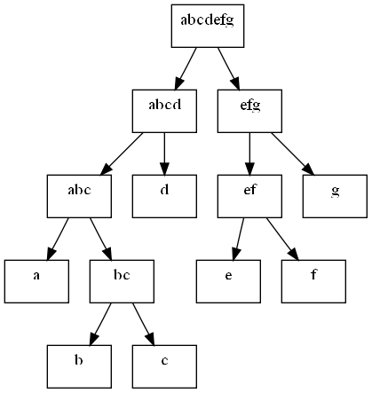
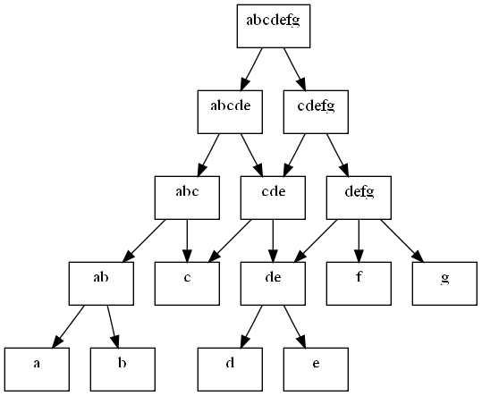

title: 알고리즘 디자인 패러다임: 파트 1
date: 2013-01-01
categories: 알고리즘
hidden: 1

[패러다임](http://ko.wikipedia.org/wiki/패러다임)이란 원래 수사학에서 유래한 말인데, 어떤 시기에 사람들의 과학적 사상과 믿음을 지배하는 이론의 틀, 혹은 결정체라는 뜻으로 사용된다고 한다. 일단 무엇보다도, 멋있는 단어이기 때문에, 이 단어는 다양한 분야에 차용되어 다양한 뜻으로 사용되고 있다. 

<!-- PREVIEW_END -->

알고리즘 설계 패러다임(algorithm design paradigm)이란, 알고리즘이 주어진 문제를 해결하기 위해 채택한 전략이나 관점을 말한다. 알고리즘이 해결하는 문제나 알고리즘의 동작 방식이 완전히 다르더라도, 알고리즘의 동작 원칙이 같다면 같은 패러다임을 사용했다고 말할 수 있다. 그런 의미에서 알고리즘 디자인 패러다임은 알고리즘들을 구분하기 위한 기준으로도 자주 사용된다. 알고리즘 디자인 패러다임은 주어진 문제를 해결하기 위한 알고리즘을 설계하는 데 좋은 틀이 되어줄 수 있기 때문에, 패러다임을 공부하는 것은 알고리즘 설계 능력을 키우기 위한 좋은 방법이 된다.

이들은 알고리즘처럼 명확히 정의된 수학적 실체가 있는 것이 아니기 때문에, 각 패러다임에 대한 설명을 보고 직관적으로 이해하기란 힘이 든다. 따라서, 다양한 예제 문제를 해결하기 위해 각 패러다임들이 적용된 예를 보면서 경험적으로 각 기법을 이해하는 것이 가장 효율적이다.

## 유명한 디자인 패러다임들

워낙에 정의부터가 명확하지 않기 때문에, 어떤 것을 디자인 패러다임이라고 분류하고 다른 것을 단순한 구현 기법이라고 분류해야 할지에 대해서는 사람에 따라 의견이 일치하지 않을 수 있다. 그나마 독립된 방법론으로서의 가치를 갖는 것만을 나열한다면, 다음과 같은 리스트를 만들 수 있다.

* 완전 및 조합 탐색 (exhaustive search, combinatorial search)
* 분할 정복 (divide and conquer)
* 동적 계획법 (dynamic programming)
* 탐욕법 (greedy methods)
* 휴리스틱 (heuristics)

## 분할 정복

분할 정복 패러다임을 차용한 알고리즘들은, 주어진 문제에 대한 답을 구하기 위해 주어진 문제를 (대개) 두 개 이상의 독립적인 부분 문제로 나눈 뒤 각각의 문제에 대한 답을 계산하고, 전체 문제에 대한 답을 부분 문제에 대한 답에서부터 거꾸로 계산해 낸다. 물론 문제를 끝없이 쪼개기만 해서는 언제까지나 답을 구할 수 없기 때문에, 분할 정복을 사용하는 알고리즘들은 대개 문제를 어느 정도 크기로 잘게 자른 후에는 더 이상 나누지 않고 직접 답을 계산해 낸다. 

(이 글에서 문제problem 란, '주어진 배열을 정렬한다' 와 같은 추상적인 작업 목표가 아니라 '1 4 3 2 6 8 을 오름 차순으로 정렬한다' 와 같이 구체적인 입력이 있는 실제 예instance 를 의미한다. 문제를 두 개 이상의 부분 문제subproblem 로 나눈다는 것은 주어진 입력을 두 개 이상의 입력으로 나눈다는 뜻이다. 예를 들어, 정렬의 대상인 수열 1 4 3 2 6 8 을 앞의 세 개 뒤의 세 개로 자르면, 1 4 3 정렬하기와 2 6 8 정렬하기의 두 개의 부분 문제를 얻을 수 있다.)

따라서, 분할 정복을 사용하는 알고리즘은 대개 다음 세 가지의 구성 요소를 가지고 있다:

* 문제를 더 작은 문제로 분할하는 과정 (divide)
* 각 문제에 대해 구한 답을 원래 문제에 대한 답으로 병합하는 과정 (merge)
* 더 이상 답을 분할하지 않고 곧장 풀 수 있는 매우 작은 문제 (base case)

분할 정복을 적용해 문제를 해결하기 위해서는 문제에 몇 가지 특성이 성립해야 한다. 우선, 문제를 부분 문제로 나누는 자연스러운 방법이 있어야 하며, 부분 문제에 대한 답을 원래 문제에 대한 답으로 조합해 내는 효율적인 방법이 있어야 한다. 주어진 배열을 크기 순서로 정렬하는 문제에는 이와 같은 특성이 잘 드러난다. 정렬을 위한 분할 정복 알고리즘들인 병합 정렬(Merge sort)과 퀵 정렬(Quick sort)을 살펴 보면 분할 정복의 구성 요소와 이들이 적용된 방식에 대해 배울 수 있다.

병합 정렬 알고리즘은 배열을 가운데에서 쪼개 비슷한 크기의 두 개의 배열로 만든 뒤, 이들을 각각 정렬한다. 정렬된 두 개의 배열은 추가적 메모리를 사용하면 쉽게 O(N) 시간에 하나의 배열로 합칠 수 있기 때문이다. 반면, 퀵 정렬 알고리즘은 배열을 단순하게 가운데에서 쪼개는 대신, 병합 과정이 필요 없도록 한 쪽의 배열에 포함된 수가 다른 쪽 배열의 수보다 항상 작은 분할을 만든다. 이를 위해 퀵 정렬은 파티션(partitioning)이라고 부르는 단계를 도입하는데, 이는 임의의 기준 원소를 지정한 후 그 원소 이하의 원소를 왼쪽, 이상의 원소를 오른쪽으로 보내는 과정이다.

이와 같이 두 알고리즘의 구체적인 분할과 합병 방식에는 차이가 있다. 병합 정렬은 가장 간단한 분할 방법을 선택함으로써, 분할 과정을 상수시간 O(1) 만에 수행한다. 대신, 각 부분으로부터 전체의 정렬된 배열을 계산하는 별도의 병합 과정을 둔다. 퀵 정렬은 한 쪽 배열의 수가 다른 쪽보다 항상 작도록 하는 복잡한 분할 과정을 택하는 대신, 병합 과정에 드는 시간을 없앤다.

## 동적 계획법

실제의 정의와 영 동떨어진 이름인지도 모르지만, 동적 계획법은 직관적으로 이해하기 매우 어렵고 가장 많은 오해를 불러 일으키는 디자인 패러다임임에 틀림없다. 동적 계획법 (dynamic programming) 이라는 말은 수학의 분과인 최적화 이론 (optimization theory) 에서 왔으며, 우리가 전산학 전반에서 일반적으로 사용하는 동적 (dynamic), 혹은 프로그래밍 (programming) 이란 단어와는 아무런 관련이 없다. (따라서, 동적 계획법을 동적 프로그래밍으로 번역하는 것은 이 패러다임의 본질을 이해하는 것을 저해하는 행동이라고 본인은 강력히 주장한다)

동적 계획법은 큰 의미에서 분할 정복과 같은 접근 방식을 의미한다. 동적 계획법을 사용하는 알고리즘들 또한 문제에 주어진 문제를 더 작은 문제들로 나눈 뒤 각각의 문제에 대한 답을 계산하고, 이 답들로부터 원래 문제에 대한 답을 계산해 내기 때문이다. 동적 계획법과 분할 정복의 차이를 가져오는 것은 문제를 나누는 방식이다. 동적 계획법에서, 어떤 부분 문제는 두 개 이상의 문제를 푸는 데 사용될 수 있다. 따라서, 이 문제의 답을 두 번 계산하는 대신 한 번만 계산하고 이를 메모리에 캐싱함으로써 속도의 향상을 꾀할 수 있다.

### 동적 계획법: 중복되는 부분 문제

위의 두 그림은 어떤 가상의 문제에 대해 다른 분할 방식이 불러오는 결과를 보여준다. 왼쪽 그림에서는 각각의 문제들이 서로 연관이 없기 때문에, 단순하게 재귀호출을 통해 문제를 분할해도 한 부분 문제가 한 번만 해결되게 된다. 그러나, 오른쪽 그림에서는, 나눠진 각각의 문제들이 서로 같은 부분 문제에 의존하게 된다. 단순하게 재귀호출을 통해 각 문제를 해결한다고 생각해 보자. 부분 문제 `cde` 는 `abcde` 를 해결할 때와 `cdefg` 를 해결하는 데 한 번씩 계산해야 한다. 그러면 `cde` 가 의존하는 `c`, `de`, `f` 들은 각각 세 번씩 계산되게 된다. 문제의 특성에 따라, 이와 같은 계산의 중복 횟수는 분할의 깊이가 깊어질 수록 지수적으로 증가하게 된다. (이와 같은 현상을 흔히 [조합 폭발](http://en.wikipedia.org/wiki/Combinatorial_explosion) 이라고 부른다) 

흔히 예로 드는 것이 [이항 계수](http://en.wikipedia.org/wiki/Binomial_coefficient)의 계산이다. 이항 계수는 다음과 같은 [점화식](http://en.wikipedia.org/wiki/Recurrence_relation) 으로 정의되는 값이다.

* $C(n,r) = C(n-1,r-1) + C(n-1,r)$
* $C(n,n) = C(n,0) = 1$

이들을 삼각형으로 늘어놓으면 다음과 같이 위 두 수를 더한 꼴이 된다 해서, 이들을 [파스칼의 삼각형](http://en.wikipedia.org/wiki/Pascal's_triangle) 이라고도 부른다.

             1
  	       1   1
         1   2   1  
	   1   3   3   1
	 1   4   6   4   1

`n`, `r` 이 주어졌을 때 `nCr` 의 값은 얼마일까? 다음과 같은 초간단 함수를 짤 수 있다:

	int bino(int n, int r) {
		if(r == 0 || n == r) return 1;
		return bino(n-1, r-1) + bino(n-1, r);

이 때, `bino(4,2)` 를 계산하기 위한 함수 호출을 추적해 보면 다음과 같다.

	bino(4,2) called
	  bino(3,1) called
		bino(2,0) called
		bino(2,1) called
		  bino(1,0) called
		  bino(1,1) called
	  bino(3,2) called
		bino(2,1) called
		  bino(1,0) called
		  bino(1,1) called
		bino(2,2) called

`bino(2,1)` 이 두 번 계산된 것을 알 수 있다. `bino(2,1)` 은 `bino(3,1)` 을 계산하기 위해서도 필요하고, `bino(3,2)` 를 계산하는 데도 필요하기 때문이다. `bino(2,1)` 은 또한, 두 번의 재귀호출을 요구하는 [계산적으로 비싼](http://en.wikipedia.org/wiki/Computationally_expensive) 함수다. 이와 같은 함수의 호출 수는 `n` 과 `r` 이 커짐에 따라 기하급수적으로 증가한다. 다음은 `n` 이 증가함에 따라 `bino(n,n/2)` 를 계산하는 데 필요한 함수 호출의 회수를 플로팅한 것이다:

{http://jmk.pe.kr/upload/get/100/2|bino() 호출의 횟수}

이와 같은 중복 계산의 오버헤드는 피할 수 없는 숙명일까? 물론 아니다. `bino()` 함수는 입력이 정해져 있을 때 출력이 정해져 있다는 사실을 이용하면 간단하게 중복 계산을 제거할 수 있다. 함수 내에서만 접근할 수 있는 정적(static) 배열을 만들어, `n` 과 `r` 에 대해 함수의 반환값을 저장하면 된다. 함수는 매번 호출될 때마다 이 테이블에 값이 계산되어 저장되어 있나 확인하고, 만약 저장되어 있다면 이것을 즉시 반환한다. 아닐 경우, 함수는 이 값을 계산한 후 반환 전에 테이블에 써 넣는다. 

~~~~
lang:cpp
int bino2(int n, int r) {
	if(r == 0 || n == r) return 1;
	static int cache[20][20];
	if(cache[n][r]) return cache[n][r]; // 0 이 아니라면 이미 계산됨
	return cache[n][r] = bino2(n-1, r-1) + bino2(n-1, r); // 계산 후 반환하면서 저장
}
~~~~

위 코드는 이와 같은 방식을 구현한다. (이 기법을 [메모이제이션memoization](http://en.wikipedia.org/wiki/Memoization) 이라고 부른다. 메모라이제이션memorization 이 아니다.) 이 알고리즘의 함수 호출 회수를 플로팅해 보면 다음 그림을 얻을 수 있다.

{http://jmk.pe.kr/upload/get/101/2|bino2() 의 호출 회수}

`n` 이 증가함에 따라 지수적으로 증가하던 함수 호출이 캐싱을 통해 상수 증가로 바뀐 것을 볼 수 있다. 이렇게, 동적 계획법은 두 번 이상 반복되어 계산되는 [중복 부분 문제](http://en.wikipedia.org/wiki/Overlapping_subproblems) (overlapping subproblems) 를 한 번만 풀음으로써 조합 폭발 현상을 해결하며, 이와 같은 특성이 동적 계획법의 상징이라고 할 수 있다. 이와 같은 의미에서, 동적 계획법을 메모리-시간 간의 트레이드오프라고 할 수도 있다.

### 최적화 문제와 동적 계획법

동적 계획법은 처음에 [최적화 문제](http://en.wikipedia.org/wiki/Optimization_problem) 들을 풀기 위한 수단으로 고안되었다. 계산 복잡도 이론이나 수학에서 이야기하는 최적화 문제란, 여러 개의 가능한 답 (feasible solutions) 이 존재하고, 그 중 가장 좋은 답을 찾아내는 문제를 말한다. 그래프 위에서의 최단 거리 문제, 최장 거리 증가 부분 수열 등의 유명한 문제들이 모두 최적화 문제다.

동적 계획법이 최적화 문제에 성공적으로 적용되려면, 중복 부분 문제 말고도 또 다른 특성이 필요하다. 다름 아닌 [최적 부분 구조](http://en.wikipedia.org/wiki/Optimal_substructure)라는 것이다. 이것은 주어진 문제를 두 개 이상으로 쪼개면, 전체 문제에 대한 최적해는 쪼갠 부분문제들의 최적해로 구성할 수 있다는 것이다. 예를 들어 말하자면, 서울부터 부산까지 가는 최단 경로를 서울-대전, 대전-부산 구간으로 나누면, 각 구간에서도 최단 경로로 움직여야 한다는 이야기다.

{http://jmk.pe.kr/upload/get/102/4|서울-부산 구간이 최단 경로려면, 서울-대전, 대전-부산 구간도 최단 경로여야 한다}

어찌 보면 별 것 아닌 얘기기는 한데, 이와 같은 속성이 성립하지 않는 문제도 가끔 있으니 이와 같은 조건에 이름을 붙인 것이 이해는 간다. 그런데, 실제로 최적 부분 구조가 동적 계획법의 존재에 필수 불가결한 요소가 되는 것으로 오해하는 경우가 많다. 이 최적 부분 구조라는 것은, 애초에 답이 여러 개 있는 최적화 문제에나 통용되는 이야기다. 위에서 이항 계수 구할 때 답이 될 수 있는 이항 계수가 여러 개 있었는가? -_-; 

엄격하게 말하자면, 동적 계획법은 처음 고안될 때는 최적화 문제를 풀기 위한 도구로 만들어졌다. 지금도 [Introduction to Algorithms](http://highered.mcgraw-hill.com/sites/0070131511/) 등의 교과서에서는 동적 계획법의 예제로 최적화 문제만을 포함하곤 한다. 하지만 현재 이 단어는 변질되어, 중복되는 부분 문제를 캐싱함으로써 최적화하는 모든 알고리즘에 적용되는 것으로 받아들여 지고 있다. 실제로 동적 계획법에 대한 [위키페디아 페이지](http://en.wikipedia.org/wiki/Dynamic_programming) 를 보면, 동적 계획법의 예로 들고 있는 것이 [피보나치 수열](http://en.wikipedia.org/wiki/Dynamic_programming#Fibonacci_sequence), [특정 조건을 만족하는 행렬의 수](http://en.wikipedia.org/wiki/Dynamic_programming#A_type_of_balanced_0-1_matrix) 등인데, 이들은 최적화 문제가 전혀 아니다.

현재, 동적 계획법이란 단어는 최적화 문제 해결의 도구만이 아니라 중복 부분 문제를 캐싱을 통해 해결하는 모든 알고리즘을 지칭하도록 확대되고 있다고 보는 것이 옳다. 

### 분할 방식에 따른 문제 특성의 변화

중복 부분 문제를 해결하는 것이 동적 계획법의 본질이라고 이야기했다. 그런데, 이 중복 부분 문제라는 특성은 해결하려는 문제에 따라 결정되는 것일까? 아니면 우리가 문제를 나누는 방법에 따라 결정되는 것일까? 정답은 어느 한 쪽이 아니라, 둘 다라고 할 수 있다. 

행렬 $A$ 의 자승 (power) $A^m$ 을 구하는 문제를 생각해 보자. $m$ 이 작으면 단순하게 $O(nm^3)$ 의 알고리즘을 써서 계산할 수 있겠지만, $m$ 이 10만 단위로 커지면 실질적인 사용이 어려워진다. 이럴 때 구세주가 되는 것이 분할 정복이다. $m$ 이 짝수라면, 다음과 같이 한 번에 $m$ 을 절반으로 뚝 자를 수 있기 때문이다.

$$A^{2x} = A^{x}A^{x}$$

하지만 $m$ 이 홀수라면 어떨까? 대개 이런 경우 문제를 나누는 패턴은 둘 중 하나가 되는데, 1을 빼는 것과 절반으로 자르는 것이다:

$$A^{2x+1} = A^{2x}A$$
$$A^{2x+1} = A^{x}A^{x+1}$$

어느 쪽이 실제로 더 유리할까? 얼핏 생각하면, 짝수일 때와 같이 절반씩으로 나누는 것이 문제의 크기를 지수적으로 줄이므로 더 유리해 보인다. 하지만, 반복되는 부분 문제를 생각해 보면 얘기가 달라진다. 두 분할 방식에서 $A^{31}$ 을 계산하기 위해 필요한 의존 관계를 각각 그래프로 나타내면 다음 그림과 같다.

{http://jmk.pe.kr/upload/get/104/3|절반씩 나누는 방법}
 
{http://jmk.pe.kr/upload/get/105/3|1씩 줄이는 방법}

비슷해 보이고 실제 계산해야 하는 값의 개수도 같아 보이지만, 위 그래프와 아래 그래프는 계산의 횟수에 큰 차이가 있다. 아래 그래프에서 모든 값은 최대 한 번씩만 계산된다. 그러나, 위 그래프에서는 얘기가 다르다. $A^8$ 은 $A^{15}$ 와 $A^{16}$ 을 계산할 때 각각 사용되므로, 두 번 계산되어야 한다. $A^4$ 는 세 번, $A^3$ 는 네 번 계산된다. 그래서, 실제 행렬의 곱셈 회수는 $m$ 에 대해 *선형적으로 증가하게 된다*! 이것을 해결하기 위해서는 중복 계산되는 값을 저장할 필요가 있는데, 그러면 $O(m)$ 에 비례하는 메모리가 필요해진다. 반면, 아래 그래프에서는 모든 값이 한 번씩만 계산된다. $A^{2x+1}=A^{x}A^{x}A$ 라는 점에 유의해 보면, 전체 곱셈의 회수는 $O(\lg m)$ 이 된다는 것을 알 수 있다. 별도의 메모리를 사용하지 않고도 이와 같은 효율을 얻을 수 있는 것이다.

이와 같이, 같은 문제에서라도 어떤 방식으로 문제를 분할하느냐에 따라 중복되는 부분 문제가 등장할 수도 있고 등장하지 않을 수도 있다. 

### 반복 스타일 (iterative style) 동적 계획법

지금까지는 동적 계획법을 설명하기 위해, 재귀 호출을 이용한 분할 정복 코드에 메모이제이션으로 캐싱을 붙이는 예제만 들었다. 하지만 점화식이 간단하다면, 재귀호출을 사용하지 않고 가장 작은 부분 문제 (base case) 로부터 답을 거꾸로 계산해 올라가는 일이 가능하다. 

위에서 예로 들었던 이항 계수의 계산이 좋은 예가 될 수 있다. 파스칼의 삼각형에서 각 숫자를 계산하기 위해서는 바로 윗줄의 숫자만 있으면 된다. 따라서, 제일 윗 줄부터 순서대로 아랫 줄로 내려가면서 각 자리에 있는 숫자를 계산한다고 하면, 윗줄에 있는 숫자들은 이미 계산한 뒤이기 때문에 재귀호출 할 필요가 없이 테이블에서 직접 값을 가져올 수 있다. 다음과 같이 말이다:

~~~~
lang:cpp
int bino[20][20];
bino[0][0] = 1;
for(int i = 1; i < 20; ++i) {
	bino[i][0] = 1;
	for(int j = 1; j <= i; ++j)
		bino[i][j] = bino[i-1][j] + bino[i-1][j-1];
}
~~~~

이와 같이, 부분문제들의 의존성이 명확한 순서를 가질 때는, 재귀호출을 사용하지 않고 반복적인 (iterative) 프로그램을 짤 수 있다. 이 때, 프로그램은 해당 부분문제를 해결하는 재귀호출을 행하는 것이 아니라 테이블의 해당 위치에 있는 값을 직접 가져온다. 이와 같은 방법을 사용하기 위해서는 답을 계산하는 순서에 유의해야 하지만, 재귀호출에 드는 오버헤드가 없기 때문에 평균적으로는 재귀호출과 함께 메모이제이션을 사용하는 방법보다 좀 더 빠른 경향이 있다.
