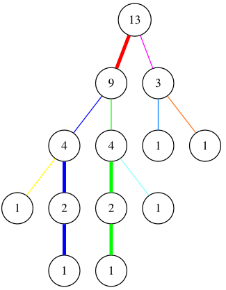

title: Heavy-Light Decomposition
date: 2015-01-21
categories: 알고리즘

작년에 1년동안 쉬면서 한 여러 가지 일 중 하나가, 오랜만에 다시 프로그래밍 대회에 참가하는 것이었다. 비록 연습만 열심히 하고 대회에 제대로 참가하진 못했지만, 최근 나온 문제들을 풀어볼 기회가 되어서 좋았다. 최근 문제 출제 경향은 과거에 비해 꽤 바뀌었음을 느꼈는데, 기존에 출제되지 않았던 테크닉들이 당연하다는 듯이 여러 대회에 나오고 있었다. 

그 중 하나가 바로 Heavy-light decomposition이다. 이런저런 연습 문제를 풀면서 공부한 김에 새 블로그 포스팅으로 쓰기로 했는데, 다 쓰기 싫어서 반년 동안 내버려 두다가 이제야 마무리해서 올려본다.

## TL;DR

$N$개의 정점을 가진 트리가 있다고 하자. 이 때 임의의 두 정점에 대해 이들을 잇는 경로는 $O(N)$개의 간선을 가진다.  Heavy light decomposition은 트리의 간선들을 적절히 일자 경로인 "묶음"들로 잘라, 임의의 두 간선 사이 경로를 $O(\lg N)$개의 묶음으로 표현할 수 있게 해 준다. 이것을 세그먼트 트리 등의 일차원 자료 구조와 결합함으로써, 임의의 두 정점 사이의 경로에 대한 연산을 $O(\lg^2N)$에 할 수 있다.

## 개관

간단한 예제 문제를 들어 보자. 가중치 간선을 갖는 트리가 있다. 문제는 다음의 두 가지 연산을 구현하는 것이다. (이 문제는 [여기](https://algospot.com/judge/problem/read/NAVI)에서 채점받을 수 있다.)

- Update(u, v, cost): 간선 (u, v) 의 가중치를 cost로 갱신한다.
- Query(u, v): 두 정점을 잇는 경로에 포함된 간선 중 최대 가중치를 반환한다.

이것을 구현하는 가장 간단한 방법은, Query가 호출될 때마다 두 정점 사이의 경로를 따라 걸으며 만나는 가중치의 최대값을 구하는 것이다. 두 정점 u, v사이의 경로는 두 정점의 LCA(최소 공통 조상, least common ancestor)로 올라가는 두 개의 경로로 분할할 수 있으므로, 다음과 같이 간단히 구현할 수 있다:

```cpp
int n; // 정점의 개수
int parent[MAXN]; // 부모 정점의 번호. 루트라면 -1
int weight[MAXN]; // 부모 정점으로 가는 간선의 가중치

// u와 v의 최소 공통 조상(least common ancestor)을 반환한다.
int lca(int u, int v) {
  ...
}

// 간선 (u,v)의 가중치를 cost로 갱신한다.
void update(int u, int v, int cost) {
  if(parent[u] == v) swap(u, v);
  assert(parent[v] == u);
  weight[v] = cost;
}

// u와 v를 잇는 간선 중 최대 가중치를 반환한다.
int query(int u, int v) {
  int max_weight = -1;
  int t = lca(u, v);
  while(u != t) { max_weight = max(max_weight, weight[u]); u = parent[u]; }
  while(v != t) { max_weight = max(max_weight, weight[v]); v = parent[v]; }
  return max_weight;
}
```

update()는 상수 시간에 동작한다. 그렇다면 query()의 시간 복잡도는 얼마일까? query()는 두 정점에서 LCA까지 가는 경로를 걸어 올라가므로, 시간 복잡도는 두 정점의 깊이에 비례한다고 하겠다. 허나 트리가 브랜치 하나 일렬로 쭉 늘어서 있다면 깊이는 $O(N)$이 된다. 이 문제의 제약 조건에서는 이것은 너무 느리다. 어떻게 하면 좋을까?

## 1차원인 경우

만약 이 문제가 트리가 아닌 1차원 배열을 다룬다면 어떻게 될까? 1차원 배열 $A$가 있고, 배열의 원소들이 계속 바뀔 때 구간의 최대값을 구하는 문제가 된다. 이것을 구간 최대 쿼리(RMQ, Range Maximum Query)라고 부르는데, 구간 트리(segment tree)를 이용하면 쉽게 풀 수 있는 문제다. (구간 트리의 소개에 관해서는 [내 책](http://book.algospot.com)의 24장을 보면 된다.)

이를 구현하는 구간 트리를 다음과 같이 구현할 수 있다.

```cpp
struct SegmentTree {
  struct SegmentTreeNode {
	int first, last; // 이 노드가 덮는 구간은 [first, last]이다.
	int max_value; // 이 구간의 최대값
	SegmentTreeNode *left, *right;
	SegmentTreeNode(int first, int last): first(first), last(last), max_value(-1) {
	  if(first != last) {
		int mid = (first + last) / 2;
		left = new SegmentTreeNode(first, mid);
		right = new SegmentTreeNode(mid+1, last);
	  }
	}

	void update(int pos, int value) {
	  // 터미널 노드인 경우 값을 바로 업데이트
	  if(first == last)
		max_value = value;
	  // 아닌 경우 적절한 가지에 값을 전파하고 구간 최대값을 업데이트 
	  else {
		if(pos <= (first + last) / 2)
		  left->update(pos, value);
		else
		  right->update(pos, value);
		max_value = max(left->max_value, right->max_value);
	  }
	}

	int query(int lo, int hi) {
	  // [lo,hi]와 [first,last]의 교집합이 없는 경우
	  if(hi < first || last < lo) return -1;
	  // [lo,hi]가 [first,last]를 포함하는 경우
	  if(lo <= first && last <= hi) return max_value;
	  // 이외의 경우 각각 나눠 최대값 찾고, 최대치를 반환
	  return max(left->query(lo, hi), right->query(lo, hi));
	}
  };

  SegmentTreeNode* root;
  SegmentTree(int n): root(new SegmentTreeNode(0, n-1)) { }

  // pos위치의 값을 value로 바꾼다.
  void update(int pos, int value) { root->update(pos, value); }

  // [lo, hi] 범위의 값 중 최대값을 구한다.
  int query(int lo, int hi) { return root->query(lo, hi); }
};
```

그런데 생뚱맞게 왜 1차원 경우에 대한 방법을 얘기했을까? HLD를 이용하면 임의의 두 정점 사이의 경로를 1차원 배열 여러 개로 분리할 수 있기 때문이다. 그리고 각 1차원 배열에 대해서 위의 구간 트리를 이용해 RMQ를 풀면 된다. 대충 감이 오는가?

## 간선 분류

우리의 목적은 트리의 간선을 무거운 간선과 가벼운 간선으로 나누는 것이다. 무거운 간선이란 무엇일까? 한 정점의 무게를 해당 정점을 루트로 하는 서브트리에 속한 정점의 수라고 하자. 부모 u에서 자식 v로 가는 간선이 있을 때, v의 무게가 u의 절반 이상이라면 이 간선은 무거운 간선, 이외의 경우는 가벼운 간선이 된다.

아까 링크했던 [문제]()의 예제 데이터를 그림으로 그리면 아래와 같다.


각 서브트리의 무게를 구하고, 무거운 간선을 굵은 선으로 표현하면 다음과 같다.


(이제 각 정점에는 해당 정점의 무게가 표시되어 있다는 점에 유의하자.) 몇 가지 사실을 눈치챌 수 있다:

* 사실 1: 한 정점에서 자손으로 내려가는 무거운 간선이 두개일 수는 없다. 두 자손의 무게가 각각 절반 이상이라면 모순이 되기 때문이다. (만약 자손이 둘 있는데 이들의 무게가 N으로 같다고 하더라도, 부모의 무게는 2N+1이므로 절반이 될 수 없다.)
* 사실 2: 가벼운 간선을 따라 부모에서 자식으로 내려가면 노드의 무게는 항상 절반 이상 줄어든다. 노드의 무게는 항상 1 이상이기 때문에, 따라서 루트에서 잎으로 가는 어떤 경로에도 가벼운 간선은 너무 많을 수 없다. 정확하게는 가벼운 간선의 수는 $O(\lg N)$개라는 것을 알 수 있다. 이 사실은 잠시 후 1차원 배열의 개수를 찾는 데 유용하게 쓰인다.

## 트리 분해

간선을 분류하고 나면, 트리의 간선들을 여러 개의 묶음으로 분해할 수 있다. 우선 인접한 무거운 간선들을 하나로 묶자. 이렇게 묶은 결과를 "무거운" 경로라고 부르자. 위에서 언급한 사실1에 의해, 이 결과는 항상 1자 경로가 된다. 위 그림에서 각 무거운 경로를 다음과 같이 구분할 수 있다.


엄밀히 정의에는 어긋나지만, 편의상 무거운 경로의 맨 윗 정점에서 그 부모로 올라가는 간선들도 해당 무거운 경로에 포함시키기로 하자. 무거운 간선에 인접하지 않은 정점은 길이가 0인 경로라고 가정하면, 모든 간선이 정확히 하나의 무거운 경로에 포함되도록 할 수 있다. 다음 그림이 이와 같은 분해 결과를 보여준다.



파란색과 녹색 무거운 경로의 최상위 정점에서 위로 올라가는 간선들이 각각 파란색과 녹색으로 색칠된 것에 유의하자. 그러면 모든 간선은 이제 정확히 하나의 무거운 경로에 속한다.

이제 각 무거운 경로들을 잘라내 일렬로 펼쳐 보자. 아래 그림을 얻을 수 있다. 


이 때 임의의 두 정점 u, v를 잇는 경로는 이 무거운 경로들의 일부들을 모아 표현할 수 있다. 예를 들어 


이 그림에서 분홍색으로 표시된 두 정점 간의 경로는 <font color="blue">파란색 경로</font>의 일부와 <font color="green">초록색 경로</font>의 일부, 그리고 <font color="cyan">하늘색 경로</font>를 모아 표현할 수 있다.

이 때 임의의 두 정점 u, v를 잇는 경로에는 몇 개의 무거운 경로가 포함될까? u, v의 최소 공통 조상이 t라고 하자. t에서 u로 트리를 따라 내려가다 보면, 무거운 경로가 끊어지는 것은 가벼운 간선을 만날 때 뿐이다. 그런데 위에서 언급한 사실2에 의해, 가벼운 간선은 $\lg N$개 이상 만날 수 없다. 따라서 u-v를 잇는 경로 상에 있는 무거운 경로의 수는 최대 $2\lg N$라는 사실을 알게 된다.

## HLD로 문제 풀기

이 점을 깨닫고 나면 앞에서 제시한 문제를 어떻게 풀어야 할지 알 수 있다. 먼저 트리를 무거운 경로들의 집합으로 쪼갠다. 각 무거운 경로들은 1자 경로이니, 각 경로마다 하나의 구간 트리를 만들어 각 간선의 가중치를 저장한다. 그러면 이 문제에서 지원해야 하는 두 개의 연산들을 다음과 같이 수행할 수 있다.

* **Update 연산**: 해당 간선이 포함된 무거운 경로를 찾고, 이 경로에서 해당 간선이 몇 번째로 오는지를 찾아낸다. 그리고 나면 해당 무거운 경로를 표현하는 구간 트리의 해당 원소를 갱신해 주면 된다.
* **Query 연산**: 두 정점을 잇는 경로를 무거운 경로의 조각들로 쪼갠다. 이 조각들은 이렇게 생겼을 것이다: [무거운 경로 번호, 경로 내에서 첫 번째 간선의 번호, 경로 내에서 마지막 간선의 번호]. 조각들을 순회하며 만들어 둔 구간 트리를 이용해 해당 조각의 최대치를 찾고, 이 중 최대치를 반환한다.

## HLD 계산하기

HLD 결과를 어떻게 저장해야 할까? 다양한 방법이 있겠지만, 여기에서 제공하는 예제 구현은 트리가 주어질 때 다음과 같은 값들을 계산한다.

* 각 정점의 깊이와, 해당 정점을 루트로 하는 서브트리의 크기  
* 무거운 경로의 목록: 각 무거운 경로마다, 경로에 포함된 정점들의 목록을 트리의 위쪽에서부터 저장한다.
* 각 정점에 대해, 부모로 가는 간선이 속한 무거운 경로의 번호

이것을 다음과 같이 선언할 수 있다.

```cpp
// 입력으로 주어지는 값들
// ======================

int n; // 정점의 수 
int parent[MAXN]; // 각 정점에 대해 부모의 번호를 저장한다. 루트는 -1
vector<int> children[MAXN]; // 각 정점마다 자식 정점의 목록을 저장한다.

// HLD가 계산하는 값들
// ===================

int subtree_size[MAXN]; // 해당 정점을 루트로 하는 서브트리의 크기 (= 정점의 무게)
int depth[MAXN]; // 트리에서 해당 정점의 깊이. 루트의 깊이는 0.

// 각 무거운 경로마다, 경로에 포함된 정점의 목록. 무거운 경로 맨 위에서 그
// 선조로 가는 가벼운 간선을 포함한다.
vector<vector<int> > heavy_paths; 
// 이 정점에서 부모로 가는 간선을 포함된 무거운 경로의 번호. 
// heavy_paths 내에서의 인덱스를 가리킨다.
vector<int> heavy_path_index;
```

임의의 간선을 가리키기 위해 두 정점 중 **자손의 번호를 사용한다는 데 유의하자**. 부모에서 자손으로 가는 간선은 여러 개가 있을 수 있지만, 한 자손에서 부모로 가는 간선의 번호는 유일하기 때문에 자손의 번호를 이용하면 간선과 1:1 관계를 쉽게 유지할 수 있다. 

HLD를 계산하는 간단한 방법은 루트에서 시작해 너비 우선 탐색을 하며, 각 경로를 만들어 나가는 것이다. 너비 우선 탐색이 정점을 방문할 때마다, 이 정점에서 부모로 올라가는 간선을 어디에 추가할지를 결정하면 된다. 이 간선이 무겁다면, 부모에서 끝나는 무거운 경로의 맨 뒤에 추가해 주면 되고, 가볍다면 이 간선에서 시작하는 무거운 경로를 새로 만들면 된다. 이와 같은 구현을 다음 코드에서 볼 수 있다.

```cpp
// depth[]와 subtree_size[]는 이미 계산되어 있다고 가정한다.
void heavy_light_decomposition(int root) {
  // 초기화
  heavy_paths.clear();
  heavy_path_index.resize(n, -1);

  // 너비 우선 탐색을 하며 heavy_paths와 heavy_path_index를 계산한다.
  queue<int> q;
  q.push(root);
  while(!q.empty()) {
	int here = q.front(); 
	q.pop();

	for(int child: children[here])
	  q.push(child);

	// here에서 자신의 부모로 올라가는 간선을 적절한 heavy_paths에 추가하자.
	// 우선 here가 트리의 루트라 부모로 올라가는 간선이 없는 경우는 무시한다.
	if(here == root) continue;

	int p = parent[here];

	// here에서 p로 올라가는 간선은 어떤 heavy_paths에 들어가야 할까?
	if(subtree_size[here] * 2 >= subtree_size[p] && p != root) {
	  // 1. 이 간선이 무겁다면, 부모에서 끝나는 무거운 경로의 맨 끝에 들어간다.
	  // (예외: 부모가 루트인 경우에는 부모에서 끝나는 무거운 경로가 아직
	  // 없으므로 새 무거운 경로를 만들어야 한다.)
	  int parent_path_index = heavy_path_index[p];
	  heavy_paths[parent_path_index].push_back(here);
	  heavy_path_index[here] = parent_path_index;
	}
	else {
	  // 2. 이 간선이 가볍다면, 이 간선으로 시작하는 새 무거운 경로를 만든다.
	  heavy_path_index[here] = heavy_paths.size();
	  heavy_paths.push_back(vector<int>(2));
	  heavy_paths.back()[0] = p;
	  heavy_paths.back()[1] = here;
	}
  }
}
```

## 구간 트리 만들기

이렇게 트리를 무거운 경로들로 분리하고 나면, 각 경로를 순회하며 각 경로에 포함된 간선의 길이에 해당하는 구간 트리를 만든다.

```cpp
// 각 무거운 경로에 해당하는 구간 트리. segment_trees[i]는 heavy_paths[i]에
// 대응된다.
vector<SegmentTree> segment_trees;

void initialize_trees() {
  segment_trees.clear();
  segment_trees.reserve(heavy_paths.size());
  // 각 무거운 경로마다 구간 트리를 만들고 모든 간선에 대해 값을 1로 지정한다.
  for(const auto& path: heavy_paths) {
	// 경로에 포함된 정점의 개수가 m개일 때, 간선의 개수는 m-1개이다.
	int m = path.size();
	segment_trees.push_back(SegmentTree(m - 1));
	for(int i = 0; i < m-1; ++i)
	  segment_trees.back().update(i, 1);
  }
}
```

## Update 연산의 구현

Update 연산을 구현하는 것은 간단하다. 우선 해당 간선이 포함된 무거운 경로의 번호를 찾고, 경로 내에서 이 간선이 몇 번째인지 찾는다. 우리는 경로 중 가장 위에 있는 간선을 0번으로 하고, 아래로 내려오며 번호를 매기기로 하자. 이렇게 하면 경로 중 가장 위에 있는 정점의 깊이를 이용해 쉽게 간선의 번호를 얻고, 구간 트리를 업데이트할 수 있다.

```cpp
// v에서 그 부모로 올라가는 간선은 이 무거운 경로에서 몇 번째의 간선일까?
// 이 경로의 맨 위에 있는 정점의 깊이와 부모의 깊이를 비교하면 쉽게 알 수 있다.
int find_edge_in_path(int path_index, int v) {
  int top_of_path = heavy_paths[path_index][0];
  return depth[parent[v]] - depth[top_of_path];
}

void update(int u, int v, int cost) {
  // 항상 u가 v의 부모이도록 하자.
  if(parent[u] == v) swap(u, v);
  assert(parent[v] == u);

  // (u,v) 가 속한 경로의 번호는?
  int path_index = heavy_path_index[v];
  // (u,v)는 이 경로에서 몇 번째 간선일까? 
  int index_in_path = find_edge_in_path(path_index, v);
  // 이 경로에 대응되는 구간 트리의 해당 원소를 갱신한다.
  segment_trees[path_index].update(index_in_path, cost);
}
```

## Query 연산의 구현

흥미로운 부분은 Query 연산이다. 우선 구현을 간단하게 하기 위해, u와 v 사이의 경로를 최소 공통 선조 t에서 쪼개자. 그리고 각각의 조각들에 대해 계산한 뒤 최대치를 구하면, 실제로 구현할 때는 항상 한 정점이 다른 정점의 조상이라고 가정하고 코드를 짤 수 있다. 

아래 코드에서 `query`는 두 정점의 최소 공통 선조 t를 구한 뒤, `query_topdown`을 이용해 두 경로 `u~t`와 `t~v`의 최대치를 각각 찾는다.

```cpp
// u와 v를 잇는 경로 중 최대값을 반환한다.
int query(int u, int v) {
  int t = lca(u, v);
  return max(query_topdown(t, u), query_topdown(t, v));
}
```

`query_topdown`은 어떻게 구현할까? 만약 이 두 정점 사이의 경로가 하나의 무거운 경로로 구성되어 있다면 구간 트리를 이용해 간단히 답을 구할 수 있을 것이다. 이외의 경우에는, v에서 u를 만날 때까지 트리를 따라 올라가며 최대치를 찾는다. 이 때, 물론 한 칸씩 올라가는 것이 아니라, 한 번마다 무거운 경로를 하나씩 떼어낸다. `v`에서 `parent[v]`로 올라가는 것이 아니라, 이 간선이 속한 무거운 경로의 맨 윗점으로 올라가는 것을 반복하면 된다. 물론 이 때, 구간 트리를 이용해 떼어낸 부분 중의 최대치를 구할 수 있다.
	
```cpp
// u에서 v로 내려가는 경로 중 최대값을 반환한다.
int query_topdown(int u, int v) {
  // u와 v가 같다면 경로에는 아무 간선도 포함되어 있지 않다.
  if(u == v) return -1;

  // 만약 u와 v가 같은 무거운 경로에 속한다면 구간 트리로 해결 가능
  if(heavy_path_index[u] == heavy_path_index[v]) {
	int path_index = heavy_path_index[u];
	// u에서 그 부모로 올라가는 간선은 [u,v] 구간에 포함되지 않고,
	// 그 다음 간선부터 포함되므로 first_edge에 1을 더해 준다.
	int first_edge = find_edge_in_path(path_index, u) + 1;
	int last_edge = find_edge_in_path(path_index, v);
	return segment_trees[path_index].query(first_edge, last_edge);
  }

  // v에서 부모로 올라가는 간선이 포함된 무거운 경로의 맨 위 정점까지 올라간다.
  int path_index = heavy_path_index[v];
  int top_of_path = heavy_paths[path_index][0];

  // v == top_of_path 인 경우는 없다. 왜일까?
  assert(top_of_path != v);

  int last_edge = find_edge_in_path(path_index, v);
  return max(query_topdown(u, top_of_path),
			 segment_trees[path_index].query(0, last_edge));
}
```

위 코드는 무거운 경로를 하나 떼낸 뒤, 남는 부분의 최대치를 구하기 위해 재귀호출을 이용한다. 

## 최소 공통 조상 찾기

`query`는 내부적으로 두 정점의 최소 공통 조상을 반환하는 함수인 `lca()`를 반환한다. 이 함수를 구현하는 방법에는 여러 가지가 있지만, 그 중 비교적 간단한 것은 다음과 같은 배열을 이용하는 것이다. 

> `exp_ancestor[i][j]` = 정점 $i$에서 부모로 가는 연결을 $2^j$번 따라갔을 때 만나는 정점의 번호

이 배열은 깊이 우선 탐색을 하면서 간단히 계산할 수 있고, 이를 이용하면 $O(\lg N)$ 시간만에 두 정점의 최소 공통 조상을 찾을 수 있다. 자세한 것은 아래 소스 코드를 참조하자.

## 시간 복잡도 분석

임의의 두 정점 사이의 경로는 $O(\lg N)$개의 무거운 경로들로 나눠질 수 있다. 각 경로에 대해 구간 트리의 연산은 전부 $O(\lg N)$의 시간이 걸리므로, 모든 구간 트리에 대해 연산하는 시간은 $O(\lg^2 N)$이 된다.

## 전체 소스 코드

다음은 [이 문제](https://algospot.com/judge/problem/read/NAVI)를 해결하는 예제 C++ 코드이다.

```cpp
#include<cstdio>
#include<cassert>
#include<cstring>
#include<map>
#include<set>
#include<time.h>
#include<algorithm>
#include<stack>
#include<queue>
#include<utility>
#include<cmath>
#include<iostream>
#include<string>
#include<vector>
using namespace std;

struct SegmentTree {
  struct SegmentTreeNode {
	int first, last; // 이 노드가 덮는 구간은 [first, last]이다.
	int max_value; // 이 구간의 최대값
	SegmentTreeNode *left, *right;
	SegmentTreeNode(int first, int last): first(first), last(last), max_value(-1) {
	  if(first != last) {
		int mid = (first + last) / 2;
		left = new SegmentTreeNode(first, mid);
		right = new SegmentTreeNode(mid+1, last);
	  }
	}

	void update(int pos, int value) {
	  // 터미널 노드인 경우 값을 바로 업데이트
	  if(first == last)
		max_value = value;
	  // 아닌 경우 적절한 가지에 값을 전파하고 구간 최대값을 업데이트 
	  else {
		if(pos <= (first + last) / 2)
		  left->update(pos, value);
		else
		  right->update(pos, value);
		max_value = max(left->max_value, right->max_value);
	  }
	}

	int query(int lo, int hi) {
	  // [lo,hi]와 [first,last]의 교집합이 없는 경우
	  if(hi < first || last < lo) return -1;
	  // [lo,hi]가 [first,last]를 포함하는 경우
	  if(lo <= first && last <= hi) return max_value;
	  // 이외의 경우 각각 나눠 최대값 찾고, 최대치를 반환
	  return max(left->query(lo, hi), right->query(lo, hi));
	}
  };

  SegmentTreeNode* root;
  SegmentTree(int n): root(new SegmentTreeNode(0, n-1)) { }

  // pos위치의 값을 value로 바꾼다.
  void update(int pos, int value) { root->update(pos, value); }
  // [lo, hi] 범위의 값 중 최대값을 구한다.
  int query(int lo, int hi) { return root->query(lo, hi); }
};

const int MAXN = 50000;

// 입력으로 주어지는 값들
// ======================

int n; // 정점의 수 
int parent[MAXN]; // 각 정점에 대해 부모의 번호를 저장한다. 루트는 -1
vector<int> children[MAXN]; // 각 정점마다 자식 정점의 목록을 저장한다.

// HLD가 계산하는 값들
// ===================

int subtree_size[MAXN]; // 해당 정점을 루트로 하는 서브트리의 크기 (= 정점의 무게)
int depth[MAXN]; // 트리에서 해당 정점의 깊이. 루트의 깊이는 0.

// 각 무거운 경로마다, 경로에 포함된 정점의 목록. 무거운 경로 맨 위에서 그
// 선조로 가는 가벼운 간선을 포함한다.
vector<vector<int> > heavy_paths; 
// 이 정점에서 부모로 가는 간선을 포함된 무거운 경로의 번호. 
// heavy_paths[] 의 인덱스를 가리킨다.
vector<int> heavy_path_index;

// exp_ancestor[i][j] = i에서 부모로 가는 간선을 2^j번 따라갔을 때 나오는 정점의
// 번호. lca() 를 위해 계산해 둔다.
vector<int> exp_ancestor[MAXN];

// 문제를 풀기 위해 계산하는 값들
// ==============================

// 각 무거운 경로에 해당하는 구간 트리. segment_trees[i]는 heavy_paths[i]에
// 대응된다.
vector<SegmentTree> segment_trees;

// HLD의 구현
// ==========

void dfs(int here) {
  subtree_size[here] = 1;

  // exp_ancestor[here]를 계산한다.
  exp_ancestor[here] = vector<int>(1, parent[here]);
  for(int log_jump = 0; ; ++log_jump) {
	// 2^log_jump번 올라가 만난 정점
	int arrived = exp_ancestor[here][log_jump];
	// 2^log_jump번 더 올라갈 수 없다면 종료
	if(exp_ancestor[arrived].size() <= log_jump) break;
	// 여기서 2^log_jump번 더 올라가면 2^(log_jump+1)번 올라간 셈이 된다.
	int next = exp_ancestor[arrived][log_jump];
	exp_ancestor[here].push_back(next);
  }

  for(int child: children[here]) {
	depth[child] = depth[here] + 1;
	dfs(child);
	subtree_size[here] += subtree_size[child];
  }
}

// depth[]와 subtree_size[]는 이미 계산되어 있다고 가정한다.
void heavy_light_decomposition(int root) {
  // 초기화
  heavy_paths.clear();
  heavy_path_index.resize(n, -1);

  // 너비 우선 탐색을 하며 heavy_paths와 heavy_path_index를 계산한다.
  queue<int> q;
  q.push(root);
  while(!q.empty()) {
	int here = q.front(); 
	q.pop();

	for(int child: children[here])
	  q.push(child);

	// here에서 자신의 부모로 올라가는 간선을 적절한 heavy_paths에 추가하자.
	// 우선 here가 트리의 루트라 부모로 올라가는 간선이 없는 경우는 무시한다.
	if(here == root) continue;

	int p = parent[here];

	// here에서 p로 올라가는 간선은 어떤 heavy_paths에 들어가야 할까?
	if(subtree_size[here] * 2 >= subtree_size[p] && p != root) {
	  // 1. 이 간선이 무겁다면, 부모에서 끝나는 무거운 경로의 맨 끝에 들어간다.
	  // (예외: 부모가 루트인 경우에는 부모에서 끝나는 무거운 경로가 아직
	  // 없으므로 새 무거운 경로를 만들어야 한다.)
	  int parent_path_index = heavy_path_index[p];
	  heavy_paths[parent_path_index].push_back(here);
	  heavy_path_index[here] = parent_path_index;
	}
	else {
	  // 2. 이 간선이 가볍다면, 이 간선으로 시작하는 새 무거운 경로를 만든다.
	  heavy_path_index[here] = heavy_paths.size();
	  heavy_paths.push_back(vector<int>(2));
	  heavy_paths.back()[0] = p;
	  heavy_paths.back()[1] = here;
	}
  }
}

void initialize_trees() {
  segment_trees.clear();
  segment_trees.reserve(heavy_paths.size());
  // 각 무거운 경로마다 구간 트리를 만들고 모든 간선에 대해 값을 1로 지정한다.
  for(const auto& path: heavy_paths) {
	// 경로에 포함된 정점의 개수가 m개일 때, 간선의 개수는 m-1개이다.
	int m = path.size();
	segment_trees.push_back(SegmentTree(m - 1));
	for(int i = 0; i < m-1; ++i)
	  segment_trees.back().update(i, 1);
  }
}

int lca(int u, int v) {
  // 편의를 위해, u와 v의 깊이가 같거나 v가 더 아래 있다고 가정한다.
  if(depth[u] > depth[v]) swap(u, v);

  // 우선 u와 v의 깊이가 다르면 같아질 때까지 v를 올린다.
  int diff = depth[v] - depth[u];
  for(int i = 0; (1<<i) <= diff; ++i) 
	if(diff & (1<<i)) 
	  v = exp_ancestor[v][i];

  // 만약 이 때 u == v라면 u가 v의 선조.
  if(u == v) return u;

  // u와 v가 같아지지 않는 한도 내에서 최대한 위로 올라간다.
  for(int i = exp_ancestor[u].size()-1; i >= 0; --i) 
	if(i < exp_ancestor[u].size() && exp_ancestor[u][i] != exp_ancestor[v][i]) {
	  u = exp_ancestor[u][i];
	  v = exp_ancestor[v][i];
	}

  // 위 루프가 종료하면 u와 v는 LCA 바로 아래 위치하게 된다.
  return exp_ancestor[u][0];
}

void read_input() {
  for(int i = 0; i < MAXN; ++i) children[i].clear();

  cin >> n;
  for(int here = 0; here < n; ++here) {
	int par;
	cin >> par;
	parent[here] = par;
	if(par != -1) children[par].push_back(here);
  }
}

// v에서 그 부모로 올라가는 간선은 이 무거운 경로에서 몇 번째의 간선일까?
// 이 경로의 맨 위에 있는 정점의 깊이와 부모의 깊이를 비교하면 쉽게 알 수 있다.
int find_edge_in_path(int path_index, int v) {
  int top_of_path = heavy_paths[path_index][0];
  return depth[parent[v]] - depth[top_of_path];
}

void update(int u, int v, int cost) {
  // 항상 u가 v의 부모이도록 하자.
  if(parent[u] == v) swap(u, v);
  assert(parent[v] == u);

  // (u,v) 가 속한 경로의 번호는?
  int path_index = heavy_path_index[v];
  // (u,v)는 이 경로에서 몇 번째 간선일까? 
  int index_in_path = find_edge_in_path(path_index, v);
  // 이 경로에 대응되는 구간 트리의 해당 원소를 갱신한다.
  segment_trees[path_index].update(index_in_path, cost);
}

// u에서 v로 내려가는 경로 중 최대값을 반환한다.
int query_topdown(int u, int v) {
  // u와 v가 같다면 경로에는 아무 간선도 포함되어 있지 않다.
  if(u == v) return -1;

  // 만약 u와 v가 같은 무거운 경로에 속한다면 구간 트리로 해결 가능
  if(heavy_path_index[u] == heavy_path_index[v]) {
	int path_index = heavy_path_index[u];
	// u에서 그 부모로 올라가는 간선은 [u,v] 구간에 포함되지 않고,
	// 그 다음 간선부터 포함되므로 first_edge에 1을 더해 준다.
	int first_edge = find_edge_in_path(path_index, u) + 1;
	int last_edge = find_edge_in_path(path_index, v);
	return segment_trees[path_index].query(first_edge, last_edge);
  }

  // v에서 부모로 올라가는 간선이 포함된 무거운 경로의 맨 위 정점까지 올라간다.
  int path_index = heavy_path_index[v];
  int top_of_path = heavy_paths[path_index][0];

  // v == top_of_path 인 경우는 없다. 왜일까?
  assert(top_of_path != v);

  int last_edge = find_edge_in_path(path_index, v);
  return max(query_topdown(u, top_of_path),
			 segment_trees[path_index].query(0, last_edge));
}

// u와 v를 잇는 경로 중 최대값을 반환한다.
int query(int u, int v) {
  int t = lca(u, v);
  return max(query_topdown(t, u), query_topdown(t, v));
}

int main() {
  int cases;
  cin >> cases;
  while(cases--) {
	read_input();

	// HLD를 계산한다.
	dfs(0);
	heavy_light_decomposition(0);
	
	// 각 무거운 경로에 대해 구간 트리를 만들어 둔다.
	initialize_trees();

	int queries;
	cin >> queries;
	while(queries--) {
	  string op;
	  cin >> op;
	  if(op == "update") {
		int u, v, cost;
		cin >> u >> v >> cost;
		update(u, v, cost);
	  }
	  else {
		int u, v;
		cin >> u >> v;
		cout << query(u, v) << endl;
	  }
	}
  }
}
```

## 연습 문제

* SRM624 Hard - TreeColoring
* Codeforces - [Motorways](http://codeforces.com/gym/100298/problem/E)
* [IPSC 2009 L - Let there be Rainbows!](http://ipsc.ksp.sk/2009/real/problems/l.html)
